# Kairo Frontend

Next.js chat interface for the Kairo AI agent platform. Real-time SSE token streaming, side-by-side artifact panel, tool call cards, file uploads, thread management, model selector with 183+ models, and persistent agent memory.

**Stack:** Next.js 16 · React 19 · TanStack Query 5 · Zustand 5 · Tailwind CSS 4
**Tests:** 188 passing across 16 spec files (Vitest + Testing Library)

---

## Table of Contents

1. [Features](#features)
2. [Quick Start](#quick-start)
3. [Deploy with Docker](#deploy-with-docker)
4. [Environment Variables](#environment-variables)
5. [Architecture](#architecture)
6. [Testing](#testing)
7. [Project Structure](#project-structure)
8. [Key Routes](#key-routes)

---

## Features

### Authentication — Register & Login

Register with email and password, then log in. JWT stored in httpOnly cookies — never accessible to JavaScript. Access token auto-refreshed on 401. Protected routes redirect to `/login`; already-authenticated users visiting `/login` are redirected to `/threads`.

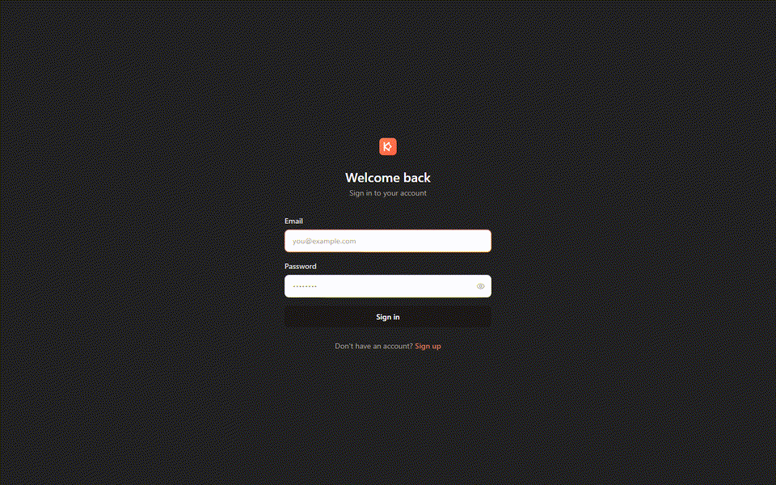

---

### Home Screen & Getting Started

After login you land on the new-chat screen with a textarea and suggestion chips. Start typing or pick a suggestion to create your first thread.

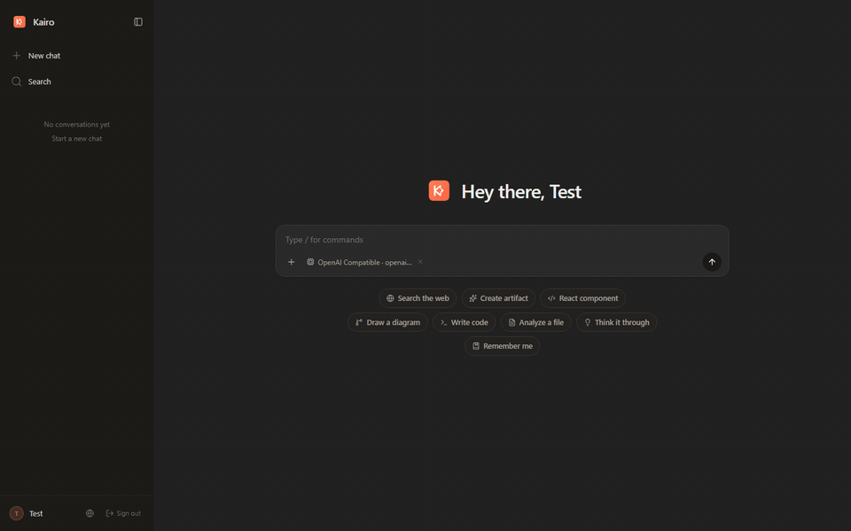

---

### Chat & Real-Time Streaming

Send a message and watch tokens appear word-by-word as the LLM streams. The input is disabled during streaming with a **Stop** button to abort mid-stream. After streaming completes, the response is saved and the streaming bubble swaps to a persisted message bubble.

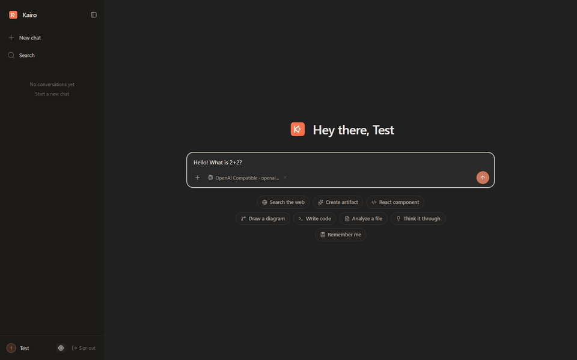

**Streaming status transitions:**
```
idle → streaming → saving → idle
```

- **Optimistic messages** — user message appears instantly before server confirms
- **Session IDs** — each stream is tagged; abort sends `POST /chat/abort` with the same ID
- **Auto-scroll** — viewport follows the stream; a FAB jumps back when the user scrolls up

---

### Model Selector — 183+ Models

Choose from 183+ models grouped by provider: OpenAI, Anthropic, Google, NVIDIA NIM, Meta, Mistral, and more. Live search filter inside the dropdown. Selection persists in `localStorage` and takes effect on the next message.


---

### Think Tool — Agent Reasoning

When the agent uses the `think` tool, an expandable scratchpad card appears inline. Click to expand and read the agent's step-by-step reasoning before the final answer.

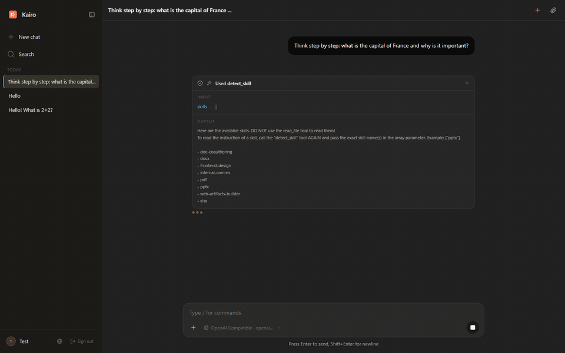

---

### Web Search Tool

Click the web search toggle in the input bar to enable it. The agent searches the web in real time and shows a tool card with the query and result snippets.

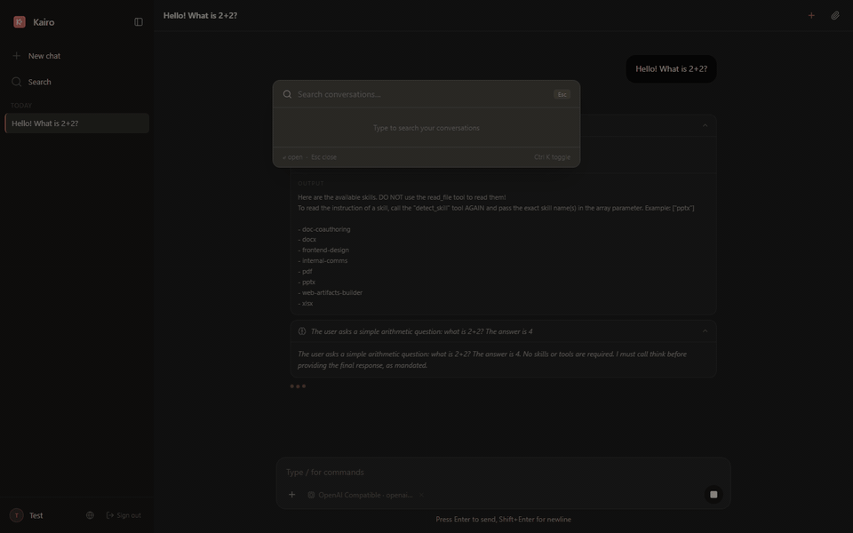

---

### Artifacts — HTML

Ask the agent to build a web page or UI component. The artifact panel opens alongside the chat with a live iframe preview. Switch to the **Source code** tab to inspect the HTML.

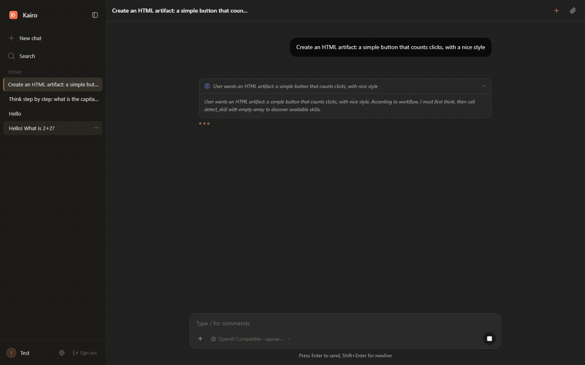

---

### Artifacts — React

Ask for a React component. The artifact panel renders it live in a Sandpack (CodeSandbox in-browser) sandbox with hot reload.

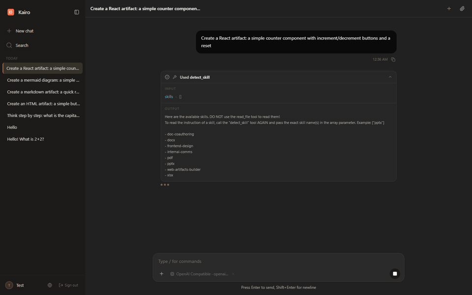

---

### Artifacts — Markdown Document

Ask for a Markdown report or document. The artifact panel renders it with full GFM: tables, task lists, code fences with syntax highlighting, and blockquotes.

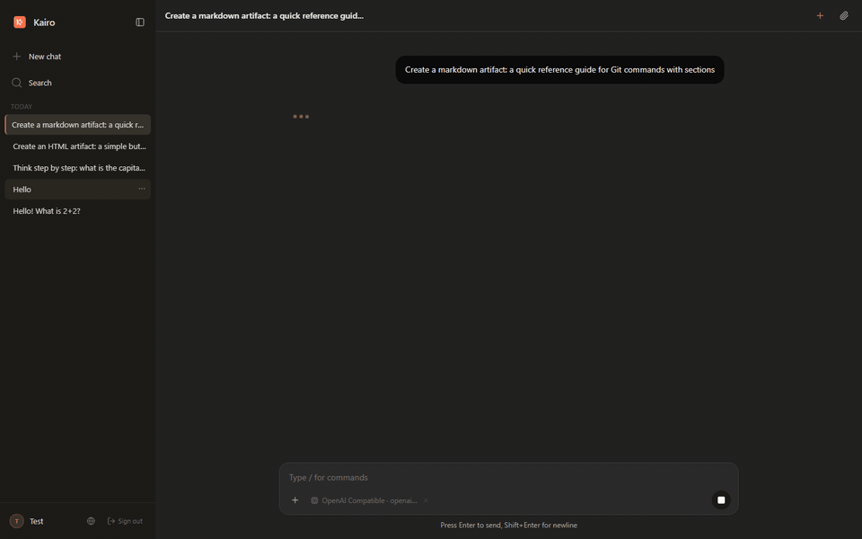

---

### Artifacts — Mermaid Diagram

Ask for a flowchart, sequence diagram, or any Mermaid chart. The panel renders it as an SVG using Mermaid.js.

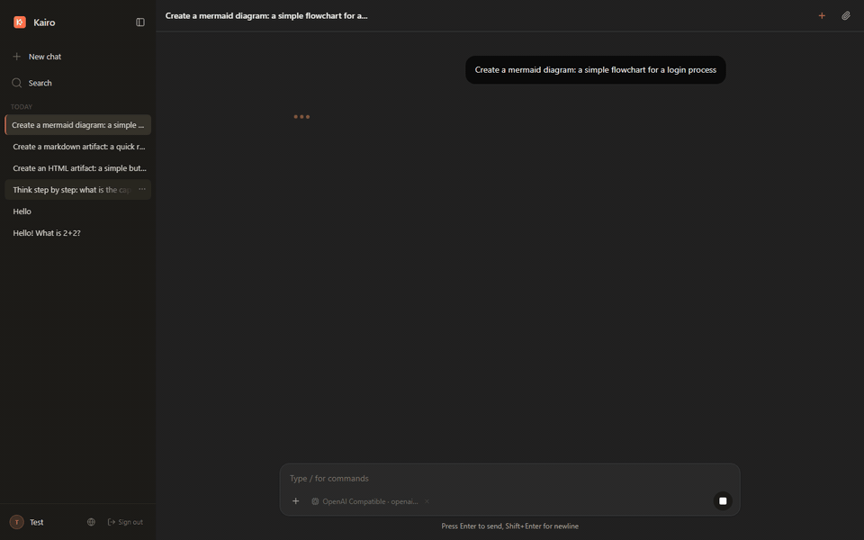

---

### Artifacts — SVG Graphic

Ask for an SVG image or icon. The panel renders it inline.

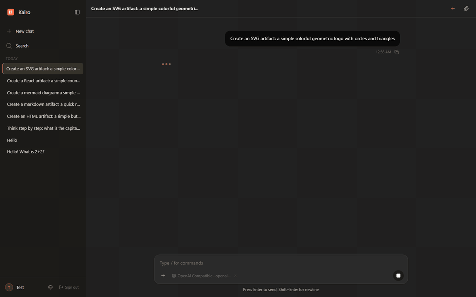

---

### Artifacts — Code File

Ask for a Python script, TypeScript module, CSS stylesheet, or any code file. The panel renders it with syntax highlighting and a language label.

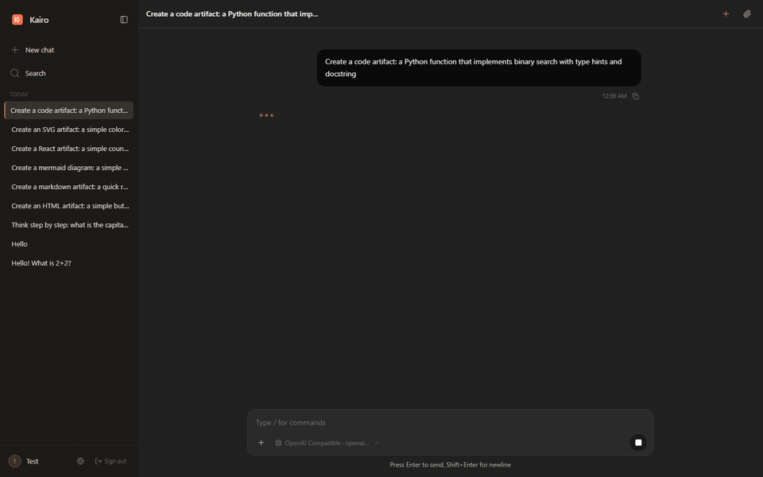

---

### Artifact Toolbar — Version Navigation

Each time the agent edits an artifact, a new version is created linked via `parentId`. The toolbar shows **v1/N** navigation arrows to step through the full history.

Toolbar actions:
- **Preview / Source code** tab toggle
- **Copy** content to clipboard
- **Download** artifact
- **v1/N ◀ ▶** version navigation (shown when N > 1)


---

### File Upload & Document Understanding

Attach files (PDF, TXT, Markdown, CSV — up to 10 MB) using the paperclip button. Files appear as chips in the input bar. On send, files are uploaded before the SSE stream so `fileId` is available to the agent's `extract_document` tool.

**Paste-to-file:** pasting text longer than 4 000 characters auto-converts it to a `.txt` attachment.

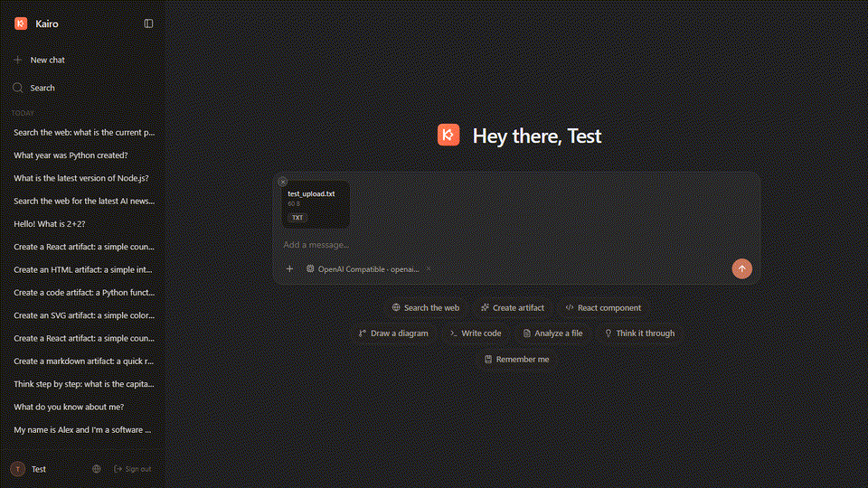

Uploaded files persist in the thread and are listed in a collapsible **Files panel** in the thread header.


---

### Thread Management — Rename, Clone, Delete

Hover over any thread in the sidebar to reveal the `...` button. The context menu offers:

- **Rename** — inline edit, commit on Enter or blur
- **Clone** — deep copy with all messages, files, and checkpoints; new thread appears at the top
- **Delete** — two-step confirmation to prevent accidental data loss

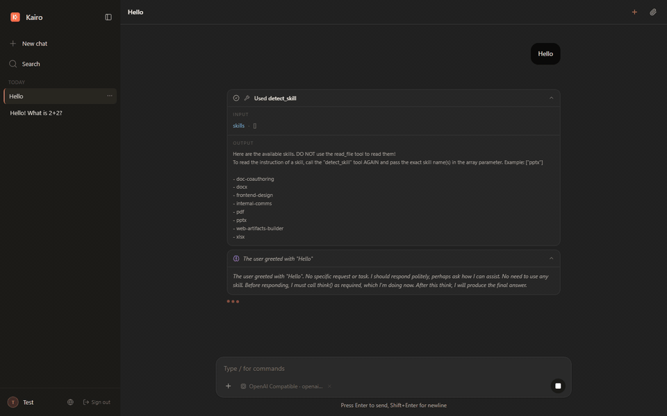

---

### Thread Search — Ctrl+K

Press `Ctrl+K` (or `Cmd+K` on Mac) to open the search modal. Results are debounced 300 ms and highlighted. Click a result to navigate to the thread.

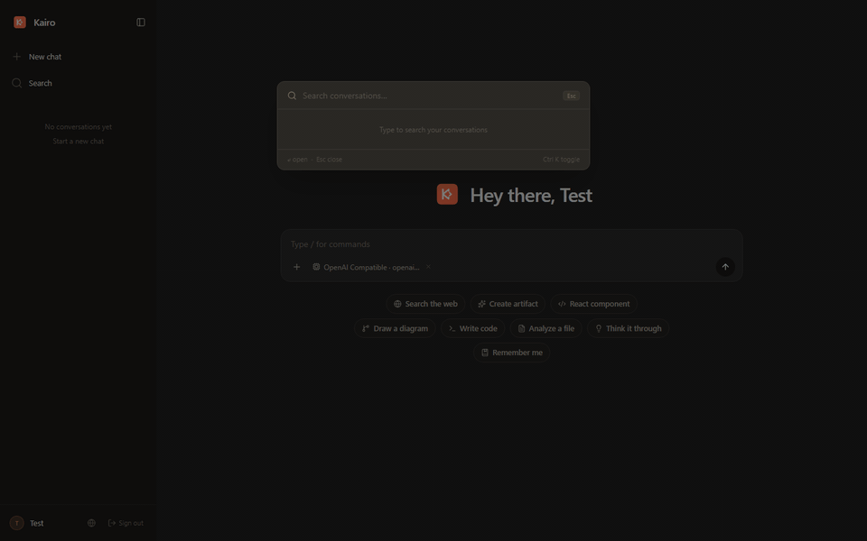

---

### Sidebar — Collapsible & Thread Groups

Threads are grouped by recency: **Today / Yesterday / Previous 7 days / Previous 30 days / Older**. Collapse the sidebar with the toggle button; state persists in `localStorage`.

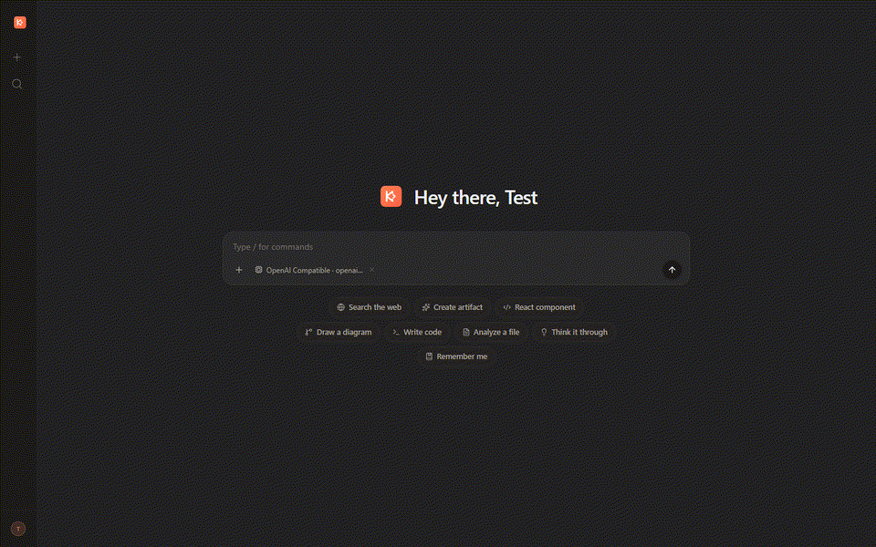

With multiple threads:

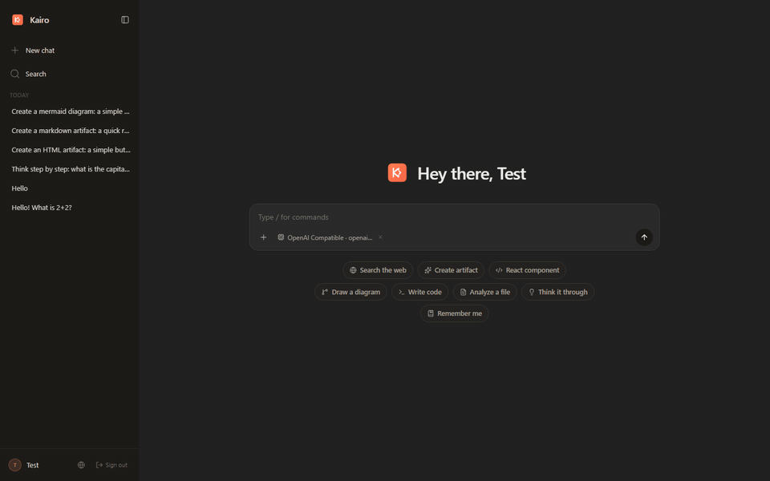

---

### Mobile — Responsive Sidebar

On screens ≤ 767 px the sidebar is hidden by default and overlaid when opened. The `useLayoutEffect` mobile detection prevents a layout flash before paint.

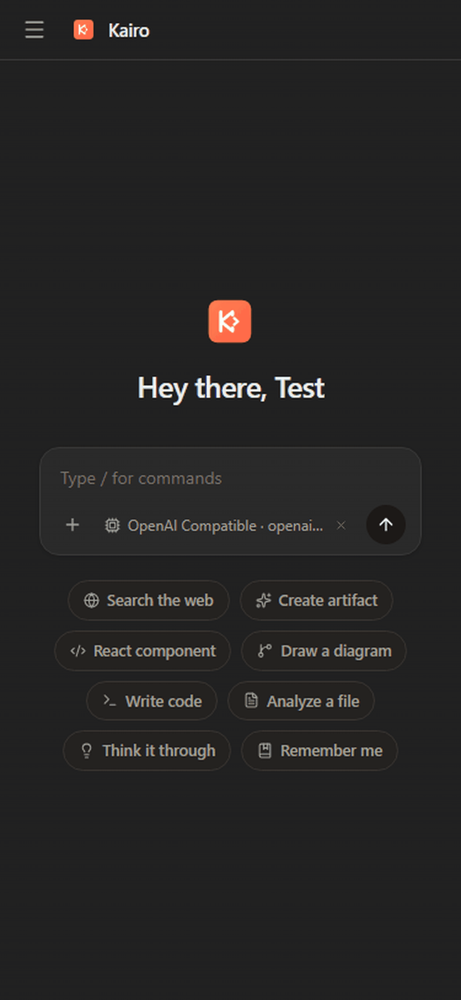

---

### User Menu — Sign Out

The user menu in the sidebar footer shows the logged-in email and a **Sign out** button with text label (not icon-only).

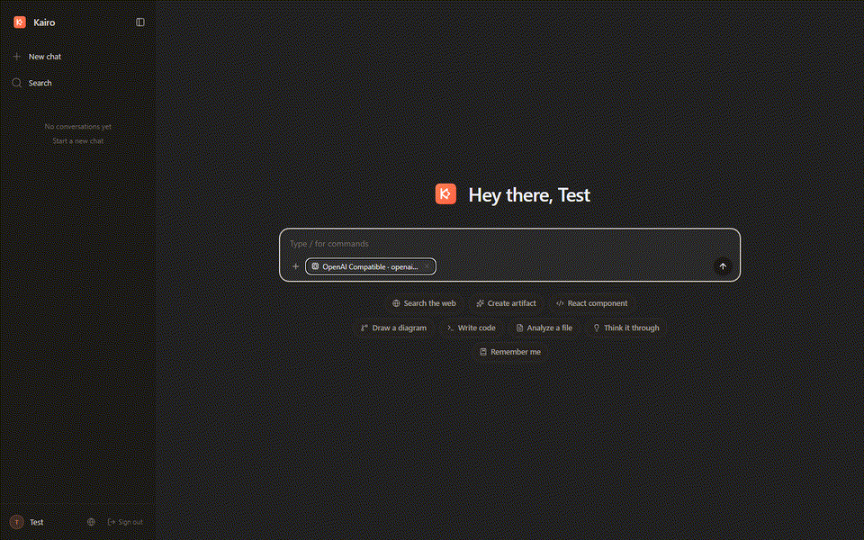

---

### Timezone Settings

Click the globe icon in the sidebar footer to open the timezone picker. Your preference is saved and applied to all timestamp displays.

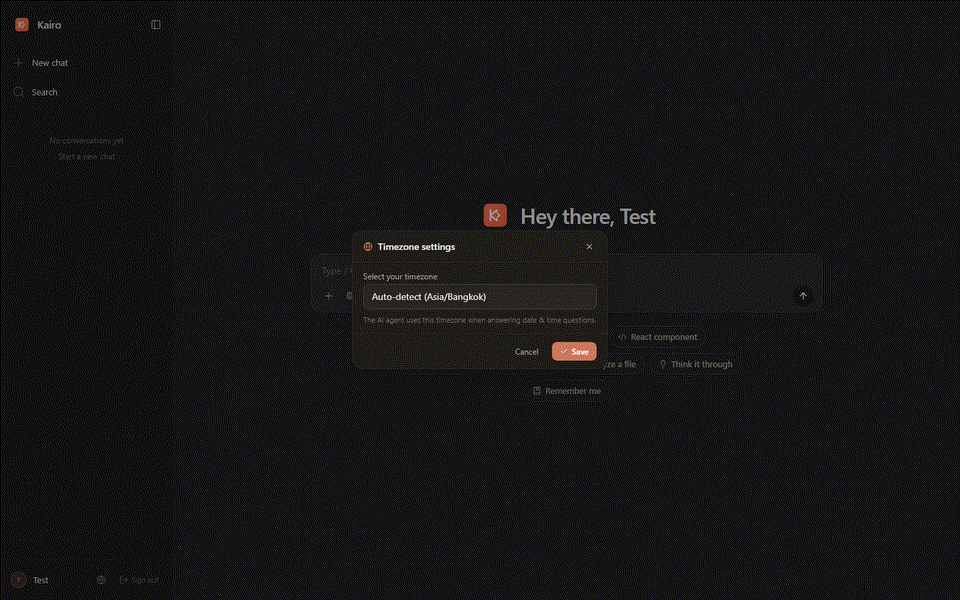

---

### AI Memory — Per-User Persistent

The agent maintains a **per-user** `AGENTS.md` file shared across all threads. Before every LLM call, `memoryMiddleware` injects it as `<agent_memory>` in the system prompt. The agent updates the file with `write_file` when it learns something worth remembering (name, preferences, instructions, feedback patterns).

The file is auto-created with a default header if it doesn't exist — no manual setup required. Large memory files (>32 K chars) are previewed; the agent is instructed to `read_file` the full file before overwriting.

---

### Skills — PDF, DOCX, XLSX, PPTX, CSV

The agent can generate downloadable files using built-in skills:

| Skill | Trigger | Output |
|-------|---------|--------|
| PDF | "generate a PDF report" | `.pdf` download |
| DOCX | "export to Word" | `.docx` download |
| XLSX | "create a spreadsheet" | `.xlsx` download |
| PPTX | "make a PowerPoint" | `.pptx` download |
| CSV | "export as CSV" | `.csv` download |

Skills call `write_file` to create the binary, then `create_artifact` with `type: "file"` to show a download chip in the artifact panel.

---

### Tool Cards — All Agent Tools

Every tool call renders as an expandable inline card that starts in loading state on `tool_start` and resolves on `tool_end`. Collapsed by default — click to expand.

| Tool card | Shows |
|---|---|
| `think` | Internal reasoning scratchpad |
| `web_search` | Query + result snippets |
| `write_file` | Path + content written |
| `read_file` | Path + content read |
| `edit_file` | Path + diff-style edits |
| `search_files` | Pattern + matching lines |
| `extract_document` | File name + extracted text |
| `create_artifact` | Type + title (link to panel) |
| `run_nodejs_script` | Script + stdout/stderr |
| `run_python_script` | Script + stdout/stderr |

---

### Agent Intelligence

- **Persistent todo list** — `todoListMiddleware` gives the agent a structured checklist that survives between model calls within the same run, so complex multi-step tasks are tracked reliably.
- **Model fallback** — if the primary LLM call fails (rate-limit, provider error), `modelFallbackMiddleware` retries with `gpt-4o-mini` automatically.
- **Tool output chunking** — results larger than ~20 000 tokens are saved to a file; the agent receives a reference, preventing context overflow.
- **Message trimming** — oldest messages are dropped when the conversation exceeds ~80 000 tokens, keeping at least the last 3 human turns.
- **Context editing** — old tool-use turns are cleared (`[cleared]`) when context exceeds 100 000 tokens, preserving the last 5 messages.

---

### Copy Button

Hover over any message bubble to reveal the **Copy** button. Clicking copies the raw text to clipboard and shows a 2-second checkmark animation.

---

### Markdown Rendering

Full GFM in every assistant message: tables, task lists, code fences with syntax highlighting, blockquotes, and inline formatting.

---

### Scroll-to-Bottom FAB

When the user scrolls more than 200 px above the latest message, a floating action button appears in the bottom-right corner to jump back instantly.

---

## Quick Start

### Prerequisites

- Node.js ≥ 22
- pnpm ≥ 9 (`npm i -g pnpm`)
- Backend running at `http://localhost:3001`

### Steps

```bash
cd fe
pnpm install

# Development — Turbopack hot reload
pnpm dev
# Open http://localhost:3000
```

```bash
# Production build
pnpm build && pnpm start
```

---

## Deploy with Docker

### Full stack (recommended)

Run from the **repo root** — starts PostgreSQL, Redis, backend, frontend, and nginx together:

```bash
# 1. Prepare backend env
cp .env.example be/.env
# Edit be/.env with your API keys and secrets

# 2. Build and start all services
docker compose up -d --build

# 3. Open the app
open http://localhost     # macOS / Linux
start http://localhost    # Windows
```

Nginx on `:80` routes:
- `/api/v1/*` → NestJS backend `:3001`
- `/*` → Next.js frontend `:3000`

### Production compose

```bash
# External DB + Redis, no exposed FE/BE ports
docker compose -f docker-compose.prod.yml up -d --build
```

### Frontend-only Docker build

```bash
cd fe
docker build -t kairo-fe .
docker run -p 3000:3000 \
  -e API_INTERNAL_URL=http://your-backend:3001 \
  -e NEXT_PUBLIC_SITE_URL=http://localhost:3000 \
  kairo-fe
```

The FE image uses Next.js `output: 'standalone'` — runner stage is ~120 MB.

---

## Environment Variables

The frontend has **no client-side secrets**. All backend communication goes through the Next.js BFF proxy route `/api/proxy/[...path]` which injects `Authorization` headers server-side.

```env
# Server-side only (BFF)
API_INTERNAL_URL=http://localhost:3001     # backend URL from Next.js server
                                          # In Docker: http://app:3001

# Build-time / public
NEXT_PUBLIC_SITE_URL=http://localhost:3000
```

> **No API keys in the frontend.** JWT is stored in `httpOnly` cookies. The BFF reads the cookie and adds `Authorization: Bearer <token>` on each proxied request.

---

## Architecture

### BFF Proxy Pattern

Every API call from the browser goes through `src/app/api/proxy/[...path]/route.ts`:

```
Browser fetch('/api/proxy/threads')
   → Next.js Route Handler
       reads httpOnly cookie → adds Authorization header
       forwards to API_INTERNAL_URL/api/v1/threads
       handles 401 → auto-refresh token
       returns response to browser
```

Benefits:
- Zero CORS issues (same-origin requests)
- JWT never accessible to JavaScript (XSS-safe)
- Token refresh is transparent to the user

### SSE Streaming

`useStream` hook opens a streaming `fetch()`:

```
POST /api/proxy/chat/send { message, stream: true }
 → BFF proxies to NestJS, forces status 200 for SSE
 → ReadableStream reader loop
     parse line-delimited SSE frames
     dispatch to Zustand chat store
```

SSE event types handled:

| Event | Action |
|---|---|
| `ping` | Ignored (Redis Stream seed) |
| `meta` | Set `confirmedThreadId`; patch thread title in cache |
| `content_block_start` | Add tool/think card |
| `content_block_delta` | Append token/thinking/tool input JSON |
| `content_block_stop` | Resolve tool card with output |
| `streaming_complete` | Unlock input, show "Saving…" |
| `message_stop` | Navigate new thread; invalidate queries; finalize |
| `token` | Append token to streaming bubble |
| `artifact` | Open artifact panel |
| `error` | Set stream error state |

### State Management

| Store | Responsibility |
|---|---|
| `chat-store.ts` | Streaming state, optimistic messages, tool events, in-progress artifacts |
| `model-store.ts` | Selected LLM provider + model (persisted to `localStorage`) |
| `ui-store.ts` | Sidebar open/closed, artifact panel, web search toggle |
| `artifact-store.ts` | Completed artifacts map, active artifact ID, panel open |

TanStack Query manages server state (threads, messages, files). Zustand manages client-only UI state.

---

## Testing

```bash
pnpm test            # run all specs once (Vitest)
pnpm test:watch      # watch mode
pnpm test:cov        # coverage report
pnpm test:ui         # Vitest browser UI
```

| Test file | What it covers |
|---|---|
| `ui-store.spec.ts` | All Zustand store actions (sidebar, scroll, web search) |
| `api-client.spec.ts` | GET/POST/PATCH/DELETE, 204 empty response, SSE stream, upload |
| `login-schema.spec.ts` | Zod login schema — valid/invalid email, password rules |
| `register-schema.spec.ts` | Zod register + password confirm mismatch |
| `copy-button.spec.tsx` | Clipboard API mock, success state animation |
| `model-store.spec.ts` | Model selection, provider change, localStorage persistence |
| `chat-store.spec.ts` | Streaming state, tool events, abort, optimistic messages |
| `artifact-store.spec.ts` | Artifact CRUD, active artifact selection, version merge |
| `utils.spec.ts` | Utility function edge cases |
| `use-debounce.spec.ts` | Debounce hook timing |
| `use-click-outside.spec.ts` | Click-outside hook ref detection |
| `sidebar-item.spec.tsx` | Thread rename, delete confirmation, clone |
| `user-menu.spec.tsx` | Sign out button text label and logout flow |
| `artifact-toolbar.spec.tsx` | Version navigation, copy, download |
| `features/artifacts/constants.spec.ts` | Artifact type → renderer mapping |
| `use-stream.spec.ts` | SSE event parsing, streaming lifecycle |
| **Total** | **188 tests across 16 files** |

---

## Project Structure

```
fe/
├── src/
│   ├── app/                            # Next.js App Router
│   │   ├── (auth)/
│   │   │   ├── login/page.tsx
│   │   │   └── register/page.tsx
│   │   ├── (chat)/
│   │   │   ├── layout.tsx             # Sidebar + ArtifactPanel + SearchModal
│   │   │   └── threads/
│   │   │       ├── page.tsx           # New-chat welcome screen
│   │   │       └── [threadId]/page.tsx
│   │   ├── api/
│   │   │   ├── proxy/[...path]/route.ts  # BFF proxy (JWT injection, refresh)
│   │   │   └── auth/                     # login / register / refresh / logout
│   │   └── page.tsx                   # Root → redirect to /threads
│   ├── components/
│   │   ├── ui/                        # Radix UI primitives
│   │   └── error-boundary.tsx
│   ├── features/
│   │   ├── auth/                      # Forms, schemas, API hooks
│   │   ├── chat/
│   │   │   ├── components/            # MessageBubble, StreamingBubble, ChatInput, ToolCard, ThinkCard
│   │   │   └── hooks/
│   │   │       ├── use-stream.ts      # SSE streaming loop
│   │   │       ├── use-messages.ts    # Paginated message list
│   │   │       └── use-models.ts      # 183+ model list
│   │   ├── threads/
│   │   │   ├── components/            # Sidebar, SidebarItem, SearchModal, UserMenu
│   │   │   └── hooks/                 # useThreads, useUpdateThread, useDeleteThread, useCloneThread
│   │   ├── artifacts/
│   │   │   ├── components/            # ArtifactPanel, ArtifactToolbar, ArtifactRenderer
│   │   │   └── api/artifacts-api.ts
│   │   └── files/                     # Upload, list, download hooks, FilePanel
│   ├── stores/
│   │   ├── chat-store.ts
│   │   ├── model-store.ts
│   │   ├── ui-store.ts
│   │   └── artifact-store.ts
│   ├── lib/
│   │   ├── api-client.ts              # Typed fetch, envelope unwrap, SSE stream
│   │   └── hooks/                     # useDebounce, useClickOutside
│   └── types/                         # Thread, Message, Artifact, File types
├── docs/
│   └── screenshots/                   # PNGs + animated GIFs (one per feature)
├── public/
├── Dockerfile
├── next.config.ts                     # output: standalone, proxy rewrites
├── tsconfig.json
└── vitest.config.ts
```

---

## Key Routes

| Route | Description |
|---|---|
| `/login` | Login form. Redirects to `/threads` if already authenticated. |
| `/register` | Registration form. |
| `/threads` | New-chat welcome screen (or thread list in sidebar). |
| `/threads/:id` | Active thread — messages, streaming, artifact panel. |
| `/api/proxy/[...path]` | BFF proxy — injects JWT, handles token refresh. |
| `/api/auth/login` | Sets httpOnly cookies on successful login. |
| `/api/auth/refresh` | Refreshes access token using refresh cookie. |
| `/api/auth/logout` | Clears auth cookies. |
