# Kairo Frontend

Next.js chat interface for the Kairo AI agent platform. Real-time SSE token streaming, side-by-side artifact panel, tool call cards, file uploads, thread management, model selector with 183+ models, and background streaming that continues even when the tab is closed.

**Stack:** Next.js 16 · React 19 · TanStack Query 5 · Zustand 5 · Tailwind CSS 4
**Tests:** 188 passing across 16 spec files (Vitest + Testing Library)

---

## Table of Contents

1. [Features](#features)
2. [Quick Start](#quick-start)
3. [Deploy with Docker](#deploy-with-docker)
4. [Environment Variables](#environment-variables)
5. [Architecture](#architecture)
6. [Testing](#testing)
7. [Project Structure](#project-structure)
8. [Key Routes](#key-routes)

---

## Features

### Authentication — Register & Login

Register with email and password, then log in. JWT stored in httpOnly cookies — never accessible to JavaScript. Access token auto-refreshed on 401. Protected routes redirect to `/login`; already-authenticated users visiting `/login` are redirected to `/threads`.


---

### Home Screen & Getting Started

After login you land on the new-chat screen with a textarea and suggestion chips. Start typing or pick a suggestion to create your first thread.


---

### Chat & Real-Time Streaming

Send a message and watch tokens appear word-by-word as the LLM streams. The input is disabled during streaming with a **Stop** button to abort mid-stream. After streaming completes, the response is saved and the streaming bubble swaps to a persisted message bubble.

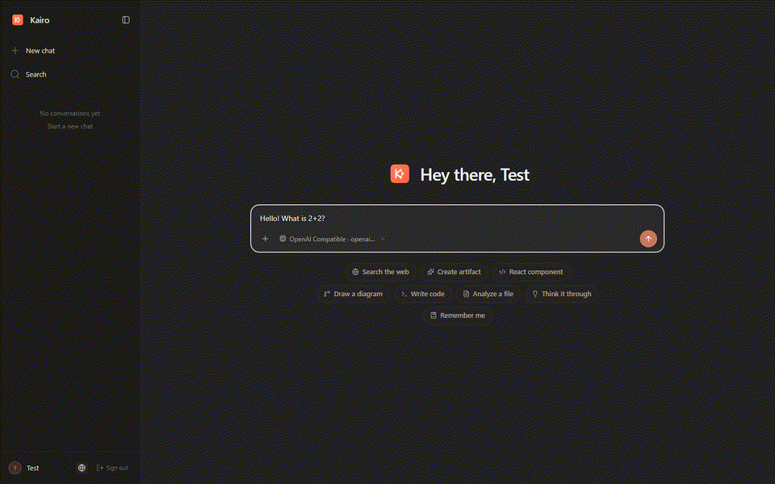

**Streaming status transitions:**
```
idle → streaming → saving → idle
```

- **Optimistic messages** — user message appears instantly before server confirms
- **Session IDs** — each stream is tagged; abort sends `POST /chat/abort` with the same ID
- **Auto-scroll** — viewport follows the stream; a FAB jumps back when the user scrolls up
- **Infinite scroll** — older messages load via cursor-based pagination as you scroll to the top
- **SSE reconnect** — if the network drops mid-stream, the client retries with `Last-Event-ID` and resumes from the exact token it lost (2-second backoff)

---

### Abort Stream & Resume Generation

Click **Stop** at any time to abort mid-stream. The content streamed so far is preserved — no error message, no lost text. A **Continue generation** button appears below the truncated message; clicking it resumes from the last checkpoint and streams the remainder.

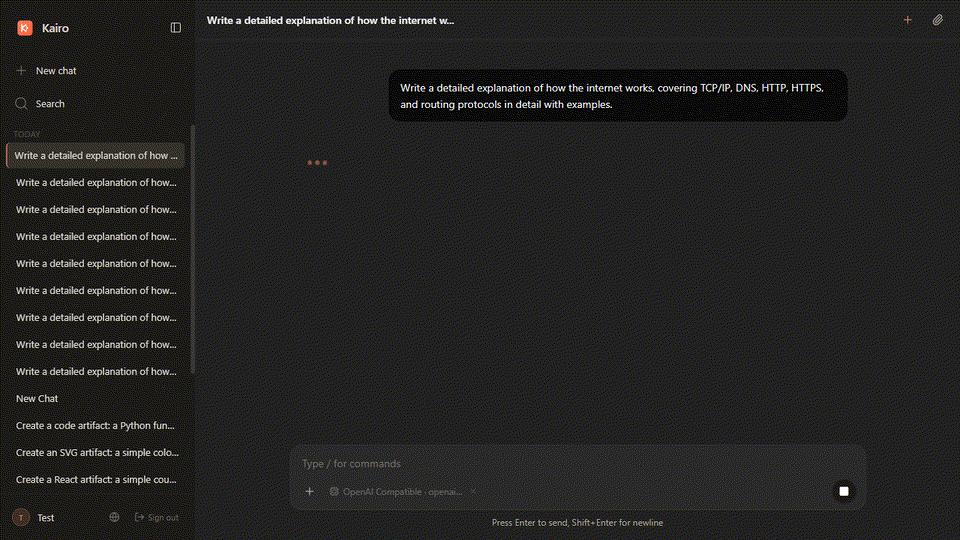

---

### Background Streaming — Continues When Tab is Closed

The agent job runs in a **BullMQ background queue worker**, decoupled from the HTTP connection. If you close the tab mid-generation:

1. The queue worker keeps running and writing events to a **Redis Stream** buffer (up to 1000 events, TTL 10 minutes)
2. When you reopen the tab (or navigate back to the thread), the app detects that the last message is a pending user turn with a `sessionId`
3. It automatically reconnects to `/chat/stream`, replays all buffered events from the Redis Stream, and renders the full response — including all tool cards, artifacts, and tokens — as if you never left

This means long-running agent tasks (file generation, multi-step research, code execution) always complete and their results are never lost.

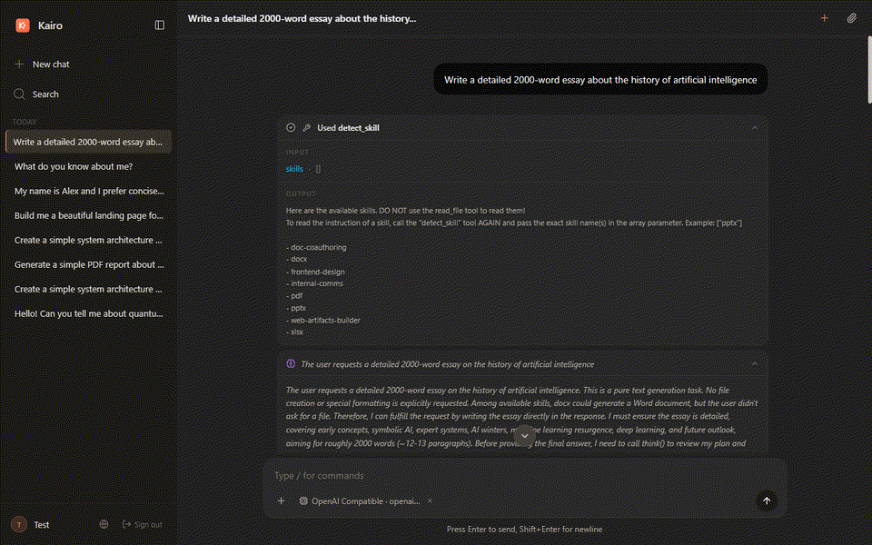

---

### Model Selector — 183+ Models

Choose from 183+ models grouped by provider: OpenAI, Anthropic, Google, NVIDIA NIM, Meta, Mistral, and more. Live search filter inside the dropdown. Selection persists in `localStorage` and takes effect on the next message.

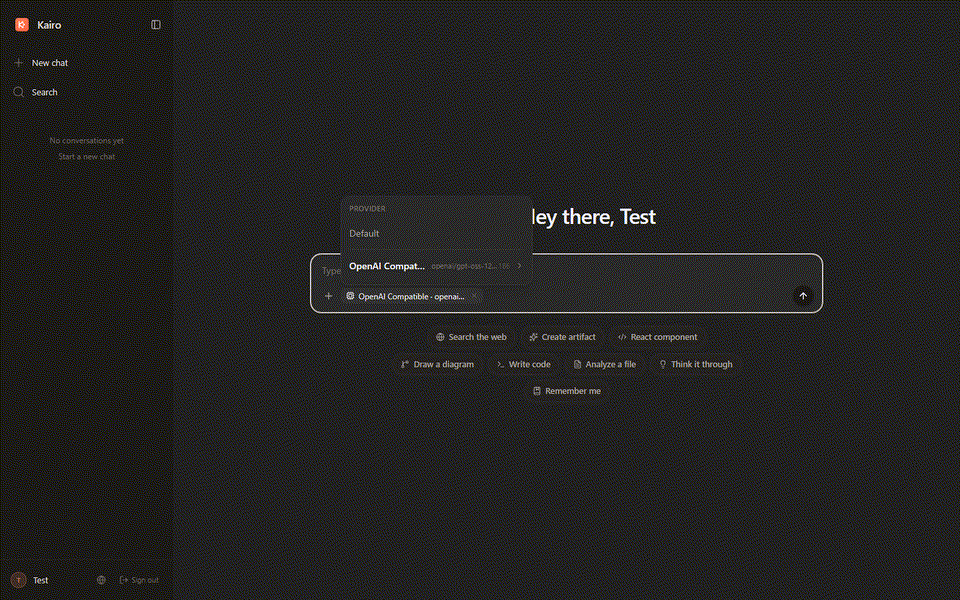

---

### Think Tool — Agent Reasoning

When the agent uses the `think` tool, an expandable scratchpad card appears inline. Click to expand and read the agent's step-by-step reasoning before the final answer.


---

### Web Search Tool

Click the web search toggle in the input bar to enable it. The agent searches the web in real time and shows a tool card with the query and result snippets.


---

### Artifacts — HTML

Ask the agent to build a web page or UI component. The artifact panel opens alongside the chat with a live iframe preview. Switch to the **Source code** tab to inspect the HTML.

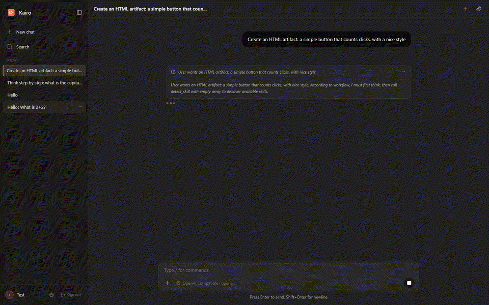

---

### Artifacts — React

Ask for a React component. The artifact panel renders it live in a Sandpack (CodeSandbox in-browser) sandbox with hot reload.

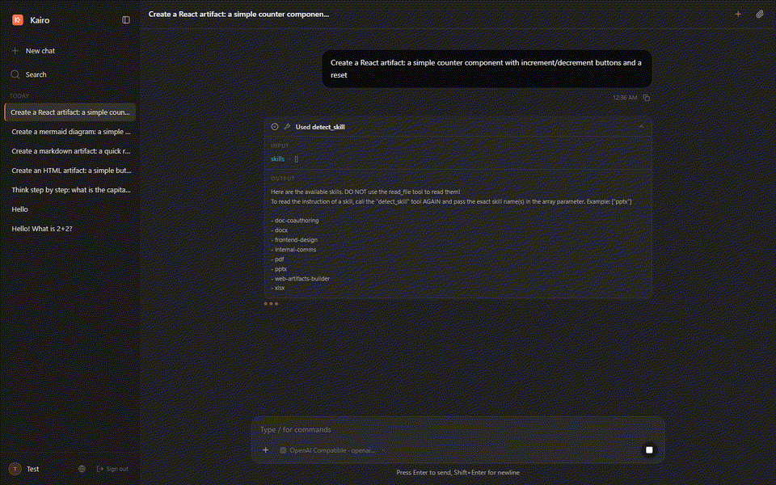

---

### Artifacts — Markdown Document

Ask for a Markdown report or document. The artifact panel renders it with full GFM: tables, task lists, code fences with syntax highlighting, and blockquotes.

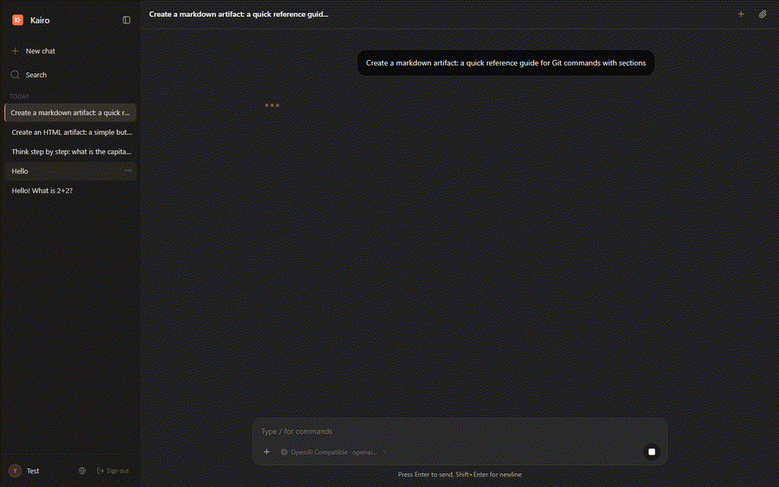

---

### Artifacts — Mermaid Diagram

Ask for a flowchart, sequence diagram, or any Mermaid chart. The panel renders it as an SVG using Mermaid.js.

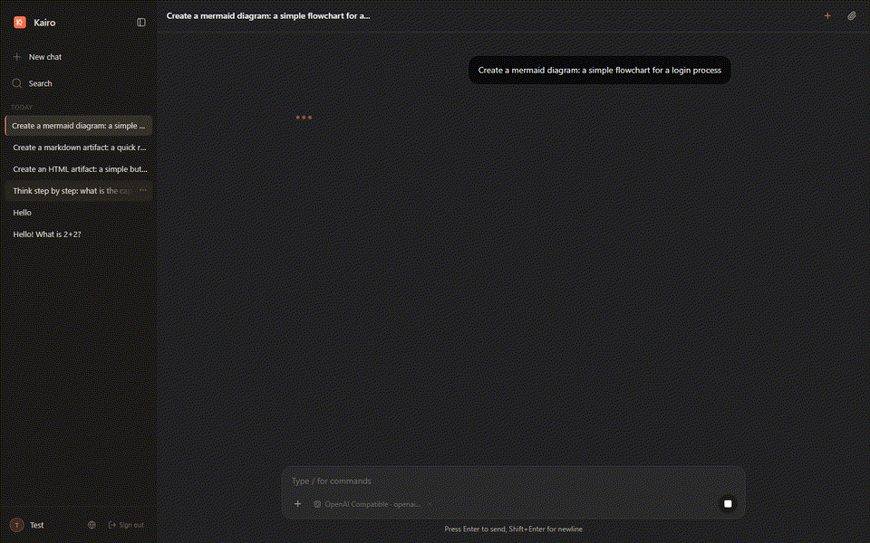

---

### Artifacts — SVG Graphic

Ask for an SVG image or icon. The panel renders it inline.

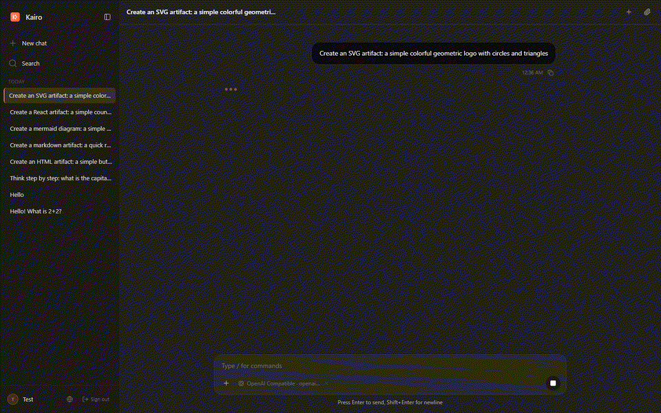

---

### Artifacts — Code File

Ask for a Python script, TypeScript module, CSS stylesheet, or any code file. The panel renders it with syntax highlighting and a language label.

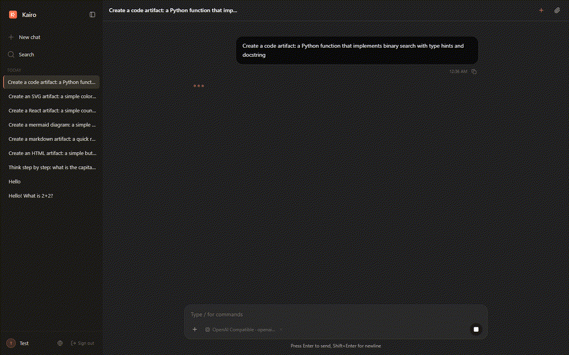

---

### Artifacts — DrawIO Diagram

Ask for a system architecture diagram, network map, or any diagram supported by Draw.io. The panel renders it in an interactive embedded Draw.io editor.

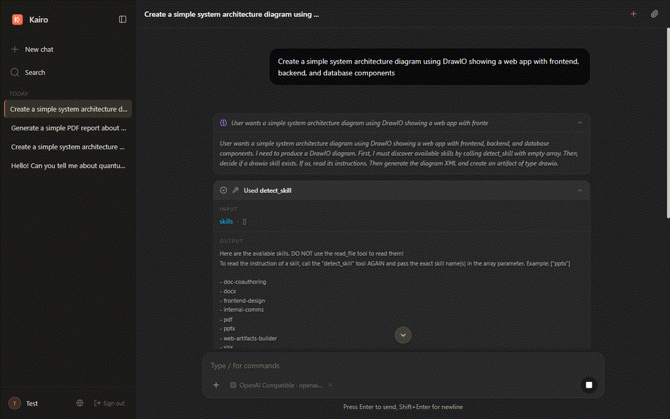

---

### Artifacts — File Download

When the agent generates a binary file (PDF, DOCX, XLSX, PPTX) via the Skills system, a **download chip** appears in the artifact panel with the file name and a one-click download button. Each file type has a dedicated **inline preview**:

| Type | Preview method |
|------|---------------|
| **PDF** | Embedded `<iframe>` (browser PDF renderer, toolbar hidden) |
| **DOCX / DOC** | Full Word document rendered via `docx-preview` — fonts, tables, images, page breaks |
| **XLSX / XLS / CSV** | Parsed client-side with SheetJS, rendered as an HTML table with multi-sheet tabs |
| **PPTX / PPT** | Converted to PDF server-side (LibreOffice headless) and shown as an inline PDF |
| **Images** | `` with `object-contain` on dark background |
| **Text / Code** | `<pre>` block; JSON is auto-pretty-printed |

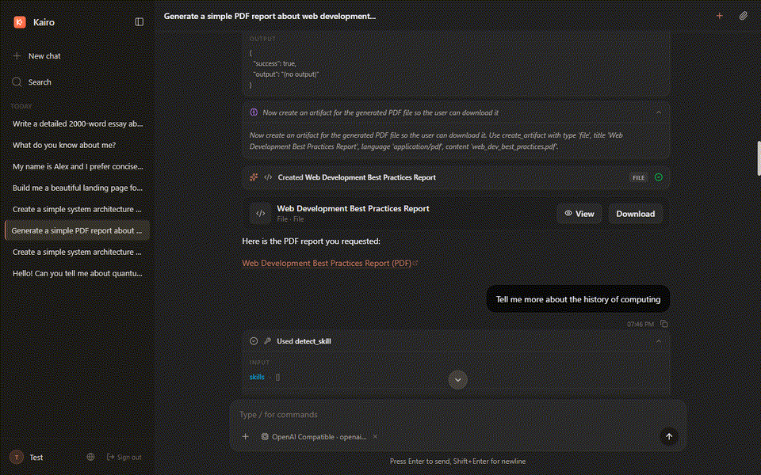

---

### Artifact Toolbar — Version Navigation

Each time the agent edits an artifact, a new version is created linked via `parentId`. The toolbar shows **v1/N** navigation arrows to step through the full history.

Toolbar actions:
- **Preview / Source code** tab toggle
- **Copy** content to clipboard
- **Download** artifact
- **v1/N ◀ ▶** version navigation (shown when N > 1)

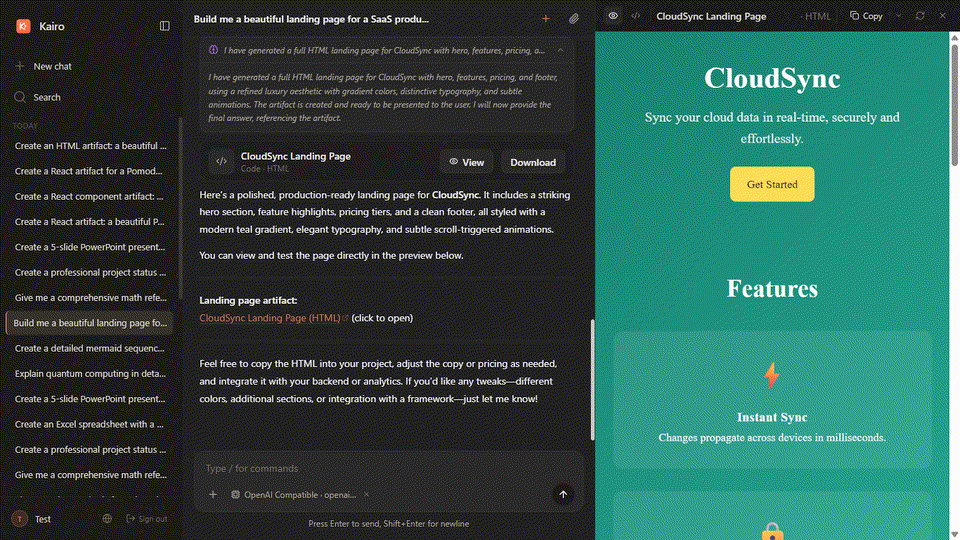
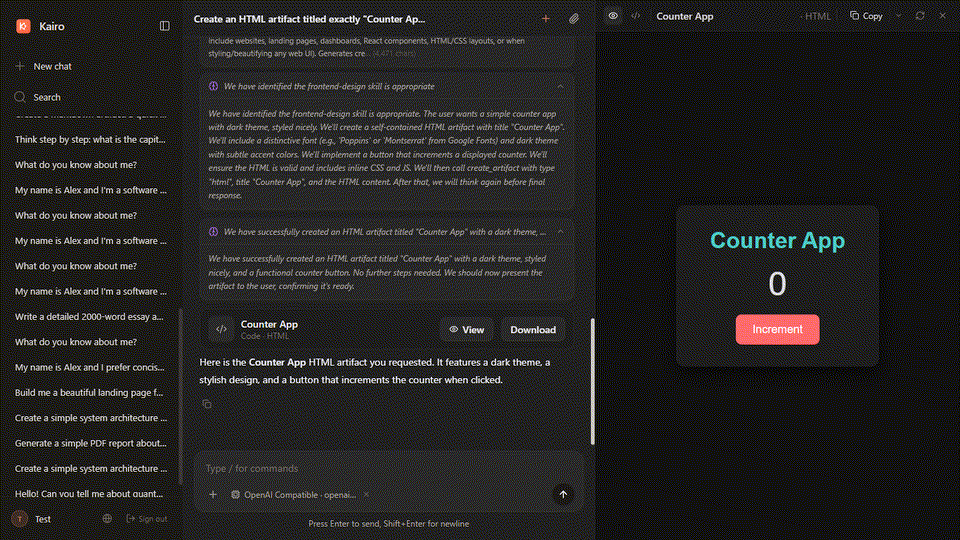

---

### File Upload & Document Understanding

Attach files using the paperclip button. Files appear as chips in the input bar. On send, files are uploaded before the SSE stream so `fileId` is available to the agent's `extract_document` tool.

**Supported types (up to 10 MB each):**
documents: `.pdf`, `.txt`, `.md`, `.csv`, `.json`, `.xml`, `.sql`, `.yaml`, `.yml`, `.toml`, `.env`
code: `.py`, `.js`, `.ts`, `.jsx`, `.tsx`, `.sh`, `.bash`, `.rb`, `.go`, `.rs`, `.java`, `.cpp`, `.c`, `.cs`, `.php`, `.swift`, `.kt`
web: `.html`, `.htm`

Text extraction happens immediately on upload (no background job). File content is validated via magic bytes (e.g. PDFs must start with `%PDF-`, JSON must be valid structure).

**Paste-to-file:** pasting text longer than 4 000 characters auto-converts it to a `.txt` attachment.


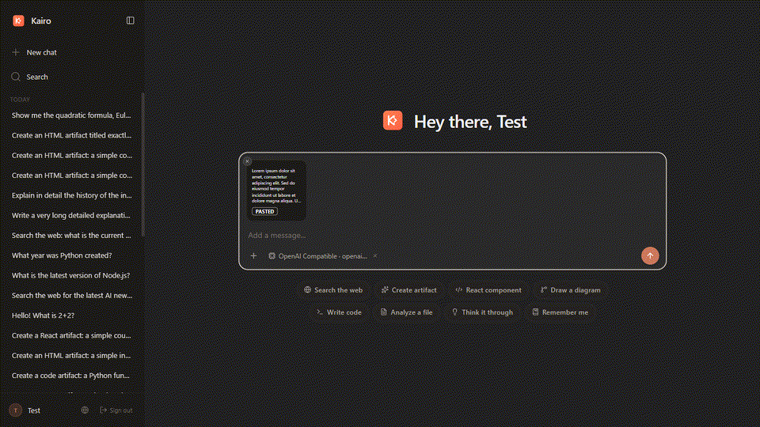

Uploaded files persist in the thread and are listed in a collapsible **Files panel** in the thread header.

---

### Thread Management — Rename, Clone, Delete

Hover over any thread in the sidebar to reveal the `...` button. The context menu offers:

- **Rename** — inline edit, commit on Enter or blur
- **Clone** — deep copy with all messages, files, and checkpoints; new thread appears at the top
- **Delete** — two-step confirmation to prevent accidental data loss

The **thread title in the header** is also editable: click it to enter edit mode, press Enter or click away to save.


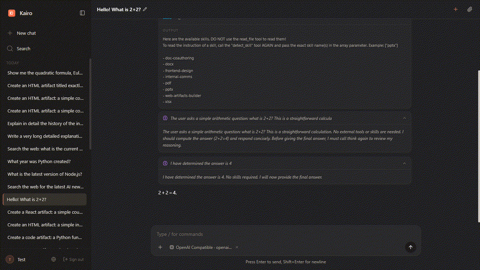

---

### Thread Search — Ctrl+K

Press `Ctrl+K` (or `Cmd+K` on Mac) to open the search modal. Results are debounced 300 ms and highlighted. Click a result to navigate to the thread.


---

### Sidebar — Collapsible & Thread Groups

Threads are grouped by recency: **Today / Yesterday / Previous 7 days / Previous 30 days / Older**. Collapse the sidebar with the toggle button; state persists in `localStorage`.


---

### Mobile — Responsive Sidebar

On screens ≤ 767 px the sidebar is hidden by default and overlaid when opened. The `useLayoutEffect` mobile detection prevents a layout flash before paint. Full streaming, markdown rendering, and artifact chips work on mobile. Artifact panels open as **full-screen overlays** on mobile.


---

### User Menu — Sign Out

The user menu in the sidebar footer shows the logged-in email and a **Sign out** button with text label (not icon-only).


---

### Timezone Settings

Click the globe icon in the sidebar footer to open the timezone picker. Your preference is saved and applied to all timestamp displays.


---

### Copy Button

Hover over any message bubble to reveal the **Copy** button. Clicking copies the raw text to clipboard and shows a 2-second checkmark animation.

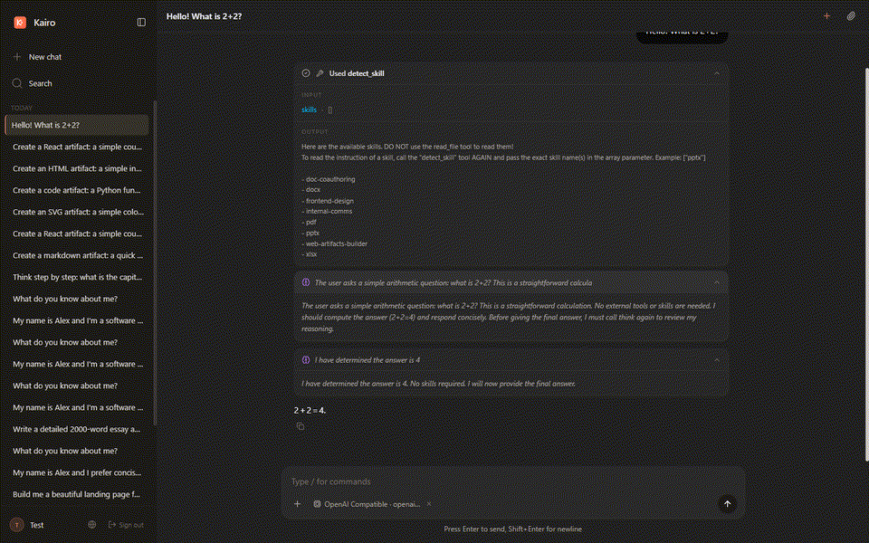

---

### Skills

The agent has built-in skills loaded from `skills/` directories. Before every task it calls `detect_skill` to pick the right skill, then follows the SKILL.md playbook.

| Skill | Description |
|-------|-------------|
| **pdf** | Generates a PDF report (reportlab + Python) |
| **docx** | Exports to a Word document (python-docx) |
| **xlsx** | Creates a formatted spreadsheet (openpyxl) |
| **pptx** | Builds a PowerPoint presentation (python-pptx) |
| **frontend-design** | Produces production-grade HTML/React artifacts with deliberate aesthetic direction — avoids generic AI patterns |
| **web-artifacts-builder** | Builds multi-component HTML apps bundled as a single file (React 18 + Vite + Tailwind + shadcn/ui) |
| **doc-coauthoring** | Structured 3-stage documentation workflow: Context Gathering → Refinement → Reader Testing |
| **internal-comms** | Templates for company communications: 3P updates, newsletters, FAQs, incident reports |

File output skills (pdf, docx, xlsx, pptx) call `write_file` to create the binary, then `create_artifact` with `type: "file"` to show a download chip in the artifact panel.

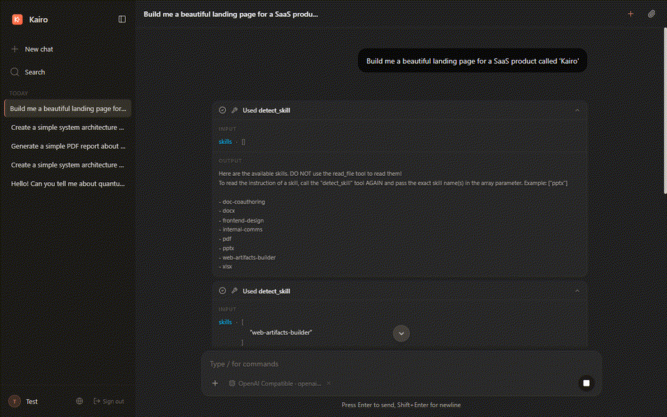

---

### Tool Cards — Agent Tools

Every tool call renders as an expandable inline card that starts in loading state on `tool_start` and resolves on `tool_end`. Collapsed by default — click to expand.

| Tool card | Shows |
|---|---|
| `think` | Internal reasoning scratchpad |
| `detect_skill` | Skill lookup + SKILL.md instructions |
| `web_search` | Query + result snippets |
| `write_file` | Path + content written |
| `read_file` | Path + content read |
| `extract_document` | File name + extracted text |
| `create_artifact` | Type + title (link to panel) |
| `run_nodejs_script` | Script + stdout/stderr |
| `run_python_script` | Script + stdout/stderr |

> `think`, `extract_document`, and `create_artifact` run silently — they emit no `tool_start`/`tool_end` events to the client and do not show a loading card.

---

### Agent Intelligence

- **Persistent todo list** — `todoListMiddleware` gives the agent a structured checklist that survives between model calls within the same run, so complex multi-step tasks are tracked reliably.
- **Model fallback** — if the primary LLM call fails (rate-limit, provider error), `modelFallbackMiddleware` retries with `gpt-4o-mini` automatically.
- **Circuit breaker** — each LLM provider has an independent circuit breaker (opens after 5 failures, resets after 30 s) to prevent cascading timeouts.
- **Tool output chunking** — results larger than ~80 000 characters are saved to a file; the agent receives a path reference, preventing context overflow.
- **Crash recovery** — if a run was interrupted mid-tool-call, synthetic `ToolMessage` placeholders are injected before resuming, keeping LangGraph state valid.
- **Message trimming** — oldest messages are dropped when the conversation exceeds ~80 000 tokens, keeping at least the last 3 human turns.
- **Context editing** — old tool-use turns are cleared (`[cleared]`) when context exceeds 100 000 tokens, preserving the last 5 messages.
- **Model/tool call caps** — hard limit of 2 500 model calls and 2 500 tool calls per run, preventing infinite loops.
- **Timezone-aware system prompt** — current date, time, timezone, and day-of-week are injected on every model call so the agent always has correct temporal context.
- **Sandboxed workspace** — every thread gets an isolated per-user filesystem directory; file tools (`read_file`, `write_file`) are scoped to it, with path traversal protection.

---

### Markdown Rendering & LaTeX Math

Full GFM in every assistant message: tables, task lists, code fences with syntax highlighting, blockquotes, and inline formatting.

**LaTeX / KaTeX math** — both inline (`$...$`) and display (`$$...$$`) math are rendered via KaTeX. Ask for formulas, equations, or proofs and the output is typeset math, not raw LaTeX strings.

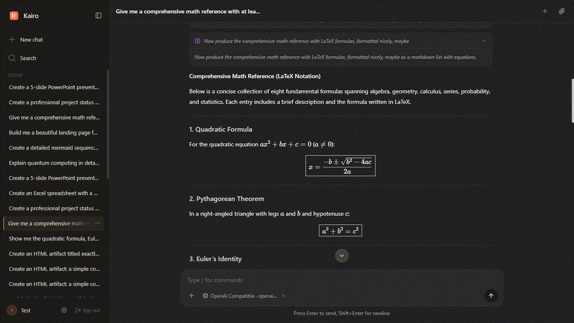

---

### Message Timestamps

Every message shows its send time (`HH:MM`) on hover. For user messages, the timestamp appears alongside the copy button.

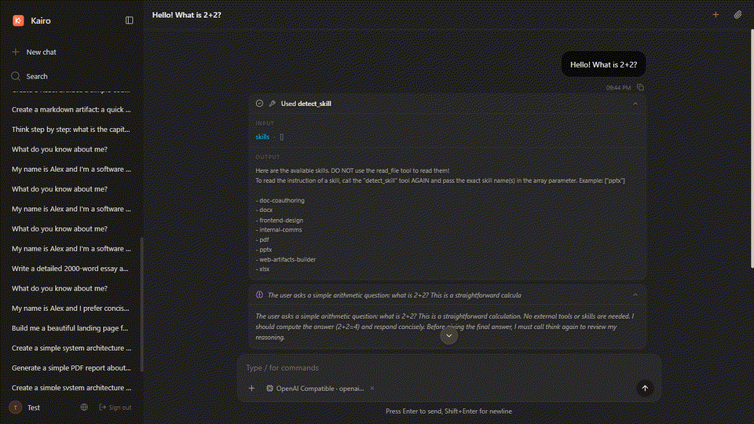

---

### Scroll-to-Bottom FAB

When the user scrolls more than 200 px above the latest message, a floating action button appears in the bottom-right corner to jump back instantly.

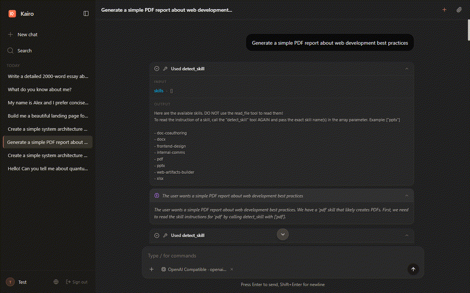

---

## Quick Start

### Prerequisites

- Node.js ≥ 22
- pnpm ≥ 9 (`npm i -g pnpm`)
- Backend running at `http://localhost:3001`

### Steps

```bash
cd fe
pnpm install

# Development — Turbopack hot reload
pnpm dev
# Open http://localhost:3000
```

```bash
# Production build
pnpm build && pnpm start
```

---

## Deploy with Docker

### Full stack (recommended)

Run from the **repo root** — starts PostgreSQL, Redis, backend, frontend, and nginx together:

```bash
# 1. Prepare backend env
cp .env.example be/.env
# Edit be/.env with your API keys and secrets

# 2. Build and start all services
docker compose up -d --build

# 3. Open the app
open http://localhost     # macOS / Linux
start http://localhost    # Windows
```

Nginx on `:80` routes:
- `/api/v1/*` → NestJS backend `:3001`
- `/*` → Next.js frontend `:3000`

### Production compose

```bash
# External DB + Redis, no exposed FE/BE ports
docker compose -f docker-compose.prod.yml up -d --build
```

### Frontend-only Docker build

```bash
cd fe
docker build -t kairo-fe .
docker run -p 3000:3000 \
  -e API_INTERNAL_URL=http://your-backend:3001 \
  -e NEXT_PUBLIC_SITE_URL=http://localhost:3000 \
  kairo-fe
```

The FE image uses Next.js `output: 'standalone'` — runner stage is ~120 MB.

---

## Environment Variables

The frontend has **no client-side secrets**. All backend communication goes through the Next.js BFF proxy route `/api/proxy/[...path]` which injects `Authorization` headers server-side.

```env
# --- Frontend (fe/.env.local) ---
API_INTERNAL_URL=http://localhost:3001     # backend URL from Next.js server
                                          # In Docker: http://app:3001
NEXT_PUBLIC_SITE_URL=http://localhost:3000
```

> **No API keys in the frontend.** JWT is stored in `httpOnly` cookies. The BFF reads the cookie and adds `Authorization: Bearer <token>` on each proxied request.

Key backend environment variables (set in `be/.env`):

```env
# Required
DATABASE_URL=postgresql://...
REDIS_URL=redis://...
JWT_ACCESS_SECRET=...
JWT_REFRESH_SECRET=...

# LLM providers (at least one required)
OPENAI_API_KEY=...
ANTHROPIC_API_KEY=...
GEMINI_API_KEY=...
OPENAI_COMPATIBLE_API_KEY=...          # e.g. NVIDIA NIM

# File storage
AGENT_FILE_ROOT=./agent-file           # workspace + uploads root
UPLOAD_MAX_SIZE_MB=10                  # default 10

# Optional features
SWAGGER_ENABLED=true                   # API docs at /api/v1/docs
LANGFUSE_PUBLIC_KEY=...                # LLM observability (langfuse.com)
LANGFUSE_SECRET_KEY=...
METRICS_API_KEY=...                    # Protects GET /api/v1/metrics
TAVILY_API_KEY=...                     # Required for web_search tool
```

---

## Architecture

### BFF Proxy Pattern

Every API call from the browser goes through `src/app/api/proxy/[...path]/route.ts`:

```
Browser fetch('/api/proxy/threads')
   → Next.js Route Handler
       reads httpOnly cookie → adds Authorization header
       forwards to API_INTERNAL_URL/api/v1/threads
       handles 401 → auto-refresh token
       returns response to browser
```

Benefits:
- Zero CORS issues (same-origin requests)
- JWT never accessible to JavaScript (XSS-safe)
- Token refresh is transparent to the user

### SSE Streaming & Background Queue

Agent jobs are decoupled from the HTTP connection using **BullMQ + Redis Streams**:

```
POST /chat/send
 → save USER message to DB
 → enqueue BullMQ job (timeout: 5 min, retries: 3)
 → write ping event to Redis Stream  ← SSE client starts reading here
 └─ [BullMQ worker — runs independently of HTTP]
       runStream() writes token/tool/artifact events → Redis Stream
       completes and saves AI message to DB

GET /chat/stream (SSE)
 → XREAD BLOCK 2000ms from Redis Stream
 → forward each event to HTTP response (SSE protocol)
 → client disconnect does NOT stop the BullMQ job
```

`useStream` hook opens a streaming `fetch()`:

```
POST /api/proxy/chat/send { message, stream: true }
 → BFF proxies to NestJS, forces status 200 for SSE
 → ReadableStream reader loop
     parse line-delimited SSE frames
     dispatch to Zustand chat store
     store last event id for reconnect
```

SSE event types handled:

| Event | Action |
|---|---|
| `ping` | Ignored (Redis Stream seed) |
| `meta` | Set `confirmedThreadId`; patch thread title in cache |
| `content_block_start` | Add tool/think card |
| `content_block_delta` | Append token/thinking/tool input JSON |
| `content_block_stop` | Resolve tool card with output |
| `streaming_complete` | Unlock input, show "Saving…" |
| `message_stop` | Navigate new thread; invalidate queries; finalize |
| `token` | Append token to streaming bubble |
| `artifact` | Open artifact panel |
| `error` | Set stream error state |

### State Management

| Store | Responsibility |
|---|---|
| `chat-store.ts` | Streaming state, optimistic messages, tool events, in-progress artifacts |
| `model-store.ts` | Selected LLM provider + model (persisted to `localStorage`) |
| `ui-store.ts` | Sidebar open/closed, artifact panel, web search toggle |
| `artifact-store.ts` | Completed artifacts map, active artifact ID, panel open |

TanStack Query manages server state (threads, messages, files). Zustand manages client-only UI state.

---

## Testing

```bash
pnpm test            # run all specs once (Vitest)
pnpm test:watch      # watch mode
pnpm test:cov        # coverage report
pnpm test:ui         # Vitest browser UI
```

| Test file | What it covers |
|---|---|
| `ui-store.spec.ts` | All Zustand store actions (sidebar, scroll, web search) |
| `api-client.spec.ts` | GET/POST/PATCH/DELETE, 204 empty response, SSE stream, upload |
| `login-schema.spec.ts` | Zod login schema — valid/invalid email, password rules |
| `register-schema.spec.ts` | Zod register + password confirm mismatch |
| `copy-button.spec.tsx` | Clipboard API mock, success state animation |
| `model-store.spec.ts` | Model selection, provider change, localStorage persistence |
| `chat-store.spec.ts` | Streaming state, tool events, abort, optimistic messages |
| `artifact-store.spec.ts` | Artifact CRUD, active artifact selection, version merge |
| `utils.spec.ts` | Utility function edge cases |
| `use-debounce.spec.ts` | Debounce hook timing |
| `use-click-outside.spec.ts` | Click-outside hook ref detection |
| `sidebar-item.spec.tsx` | Thread rename, delete confirmation, clone |
| `user-menu.spec.tsx` | Sign out button text label and logout flow |
| `artifact-toolbar.spec.tsx` | Version navigation, copy, download |
| `features/artifacts/constants.spec.ts` | Artifact type → renderer mapping |
| `use-stream.spec.ts` | SSE event parsing, streaming lifecycle |
| **Total** | **188 tests across 16 files** |

---

## Project Structure

```
fe/
├── src/
│   ├── app/                            # Next.js App Router
│   │   ├── (auth)/
│   │   │   ├── login/page.tsx
│   │   │   └── register/page.tsx
│   │   ├── (chat)/
│   │   │   ├── layout.tsx             # Sidebar + ArtifactPanel + SearchModal
│   │   │   └── threads/
│   │   │       ├── page.tsx           # New-chat welcome screen
│   │   │       └── [threadId]/page.tsx
│   │   ├── api/
│   │   │   ├── proxy/[...path]/route.ts  # BFF proxy (JWT injection, refresh)
│   │   │   └── auth/                     # login / register / refresh / logout
│   │   └── page.tsx                   # Root → redirect to /threads
│   ├── components/
│   │   ├── ui/                        # Radix UI primitives
│   │   └── error-boundary.tsx
│   ├── features/
│   │   ├── auth/                      # Forms, schemas, API hooks
│   │   ├── chat/
│   │   │   ├── components/            # MessageBubble, StreamingBubble, ChatInput, ToolCard, ThinkCard
│   │   │   └── hooks/
│   │   │       ├── use-stream.ts      # SSE streaming loop
│   │   │       ├── use-messages.ts    # Paginated message list
│   │   │       └── use-models.ts      # 183+ model list
│   │   ├── threads/
│   │   │   ├── components/            # Sidebar, SidebarItem, SearchModal, UserMenu
│   │   │   └── hooks/                 # useThreads, useUpdateThread, useDeleteThread, useCloneThread
│   │   ├── artifacts/
│   │   │   ├── components/
│   │   │   │   ├── renderers/             # html, react, markdown, mermaid, svg, code, drawio, file
│   │   │   │   ├── ArtifactPanel.tsx
│   │   │   │   └── ArtifactToolbar.tsx
│   │   │   └── api/artifacts-api.ts
│   │   └── files/                     # Upload, list, download hooks, FilePanel
│   ├── stores/
│   │   ├── chat-store.ts
│   │   ├── model-store.ts
│   │   ├── ui-store.ts
│   │   └── artifact-store.ts
│   ├── lib/
│   │   ├── api-client.ts              # Typed fetch, envelope unwrap, SSE stream
│   │   └── hooks/                     # useDebounce, useClickOutside
│   └── types/                         # Thread, Message, Artifact, File types
├── docs/
│   └── screenshots/                   # PNGs organized by feature (one folder per feature)
│       ├── auth/
│       ├── home/
│       ├── model_selector/
│       ├── chat/
│       ├── abort_resume/
│       ├── think_tool/
│       ├── web_search/
│       ├── artifacts/
│       │   ├── html/
│       │   ├── react/
│       │   ├── markdown/
│       │   ├── mermaid/
│       │   ├── svg/
│       │   ├── code/
│       │   ├── drawio/
│       │   └── file/
│       ├── artifact_toolbar/
│       ├── file_upload/
│       ├── thread_management/
│       ├── search/
│       ├── sidebar/
│       ├── mobile/
│       ├── user_menu/
│       ├── settings/
│       ├── copy_button/
│       ├── scroll_fab/
│       ├── skills/
│       ├── background_streaming/
│       └── misc/
├── public/
├── Dockerfile
├── next.config.ts                     # output: standalone, proxy rewrites
├── tsconfig.json
└── vitest.config.ts
```

---

## Key Routes

### Frontend (Next.js)

| Route | Description |
|---|---|
| `/login` | Login form. Redirects to `/threads` if already authenticated. |
| `/register` | Registration form. |
| `/threads` | New-chat welcome screen (or thread list in sidebar). |
| `/threads/:id` | Active thread — messages, streaming, artifact panel. |
| `/api/proxy/[...path]` | BFF proxy — injects JWT, handles token refresh. |
| `/api/auth/login` | Sets httpOnly cookies on successful login. |
| `/api/auth/refresh` | Refreshes access token using refresh cookie. |
| `/api/auth/logout` | Clears auth cookies. |

### Backend API (`/api/v1/`)

| Route | Description |
|---|---|
| `POST /auth/register` | Register new user. Rate limited: 20/15 min. |
| `POST /auth/login` | Login; returns access + refresh tokens. Rate limited: 20/15 min. |
| `POST /auth/refresh` | Rotate refresh token. Replay-attack protected. |
| `POST /auth/logout` | Invalidate refresh token. |
| `POST /chat/send` | Send message. `stream:true` → SSE; `stream:false` → JSON. |
| `POST /chat/stream` | SSE-only stream. Supports `Last-Event-ID` reconnect. |
| `POST /chat/resume` | Resume agent from last LangGraph checkpoint. |
| `POST /chat/abort` | Abort a running stream by sessionId. |
| `GET /threads` | List threads with cursor pagination + search. |
| `POST /threads` | Create thread. |
| `PATCH /threads/:id` | Rename or change provider. |
| `DELETE /threads/:id` | Delete thread. |
| `DELETE /threads` | Delete ALL threads for current user. |
| `POST /threads/:id/clone` | Deep-copy thread (messages + files + artifacts). |
| `GET /threads/:id/messages` | Paginated message history. |
| `GET /threads/:id/files` | List uploaded files. |
| `GET /threads/:id/artifacts` | List artifacts. |
| `POST /files/upload` | Upload file (multipart). |
| `GET /files/:id/download` | Download raw file. |
| `GET /artifacts/:id` | Get artifact (with optional `?version=N`). |
| `GET /artifacts/:id/download` | Download artifact as file. |
| `GET /artifacts/:id/preview-pdf` | Convert PPTX artifact to PDF preview via LibreOffice. |
| `GET /llm/models` | List all providers and their available models. |
| `GET /health` | Health check — DB + Redis status. Returns 200/503. No auth. |
| `GET /metrics` | Prometheus metrics. Optional `METRICS_API_KEY` bearer token. |
| `GET /docs` | Swagger UI. Requires `SWAGGER_ENABLED=true`. |
